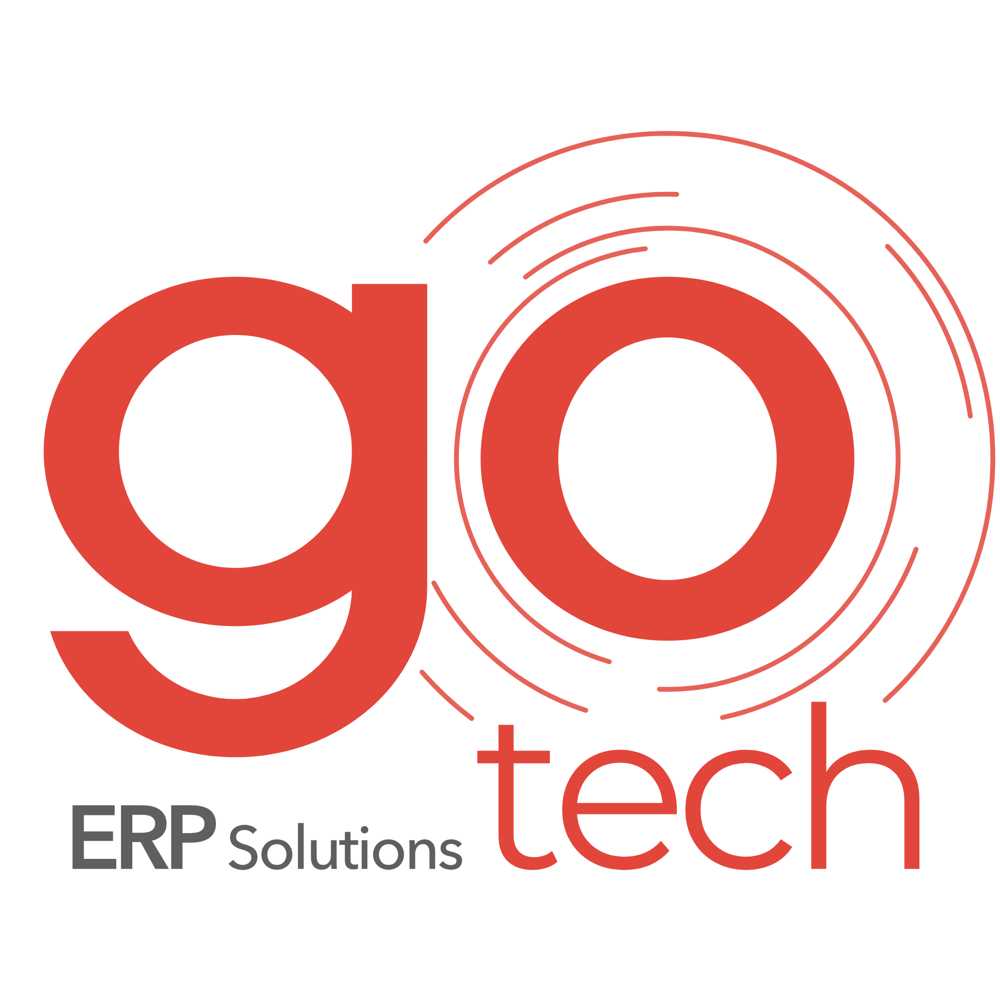

<p align="center">
  <br>
  <b>GoTechDesk — GoTech uzak destek uygulaması</b>
</p>

GoTechDesk, GoTech'in kendi sunucusunda çalışan uzak destek uygulamasıdır. Açık kaynaklı
[RustDesk](https://github.com/rustdesk/rustdesk)'in bir fork'udur; bağlantılar başka hiçbir
firmanın sunucusundan geçmez, kendi makinemize (rendezvous + relay) gider.

- Müşteri bilgisayarları: **Windows**
- GoTech ekibi: **Windows / macOS**
- Panel: [GoTech Paneli](https://gotech-web-31-40-199-183.sslip.io) — bilgisayarlar, destek talepleri, tek tıkla bağlanma

---

## Müşteriler için — nasıl çalışır?

> Bu bölümü müşteriye olduğu gibi gönderebilirsiniz.

**GoTechDesk nedir?** GoTech'in size uzaktan destek verebilmesi için bilgisayarınıza
kurduğunuz küçük bir programdır. Bir arıza olduğunda telefonda tarif etmek yerine,
ekranınızı bizim görmemizi ve gerekirse sorunu doğrudan çözmemizi sağlar.

**Kurulum**

1. GoTech'in size gönderdiği indirme bağlantısına tıklayın; dosya `GoTechDesk-123456.exe`
   gibi firma kodunuzu taşıyan bir adla iner.
2. Dosyayı çalıştırıp kurun. Firma kodu dosyanın içinden geldiği için **kod yazmanıza gerek yok**.
3. Program ilk açıldığında sadece **adınızı** seçersiniz (listede yoksa yazabilir, ortak
   kullanılan bir bilgisayarsa "Ortak bilgisayar" diyebilirsiniz).
4. Bilgisayar artık GoTech panelinde görünür. Kapatmadığınız sürece destek istediğinizde
   hazırdır.

**Destek nasıl başlar?**

- Uygulamadaki **Destek iste** düğmesine basarsınız; talep GoTech'e düşer.
- Bir GoTech teknisyeni bağlanmak istediğinde ekranınızda bir onay kutusu çıkar ve
  **kimin bağlandığını isim isim yazar** (örnek: *GoTech Destek · Abdullah Hüseyin Efe*).
  Siz onaylamadan kimse bağlanamaz.
- Bağlantı sırasında ekranınızda ne olduğunu görürsünüz; istediğiniz an oturumu
  kapatabilirsiniz.

**Güvenlik**

- Uygulama yalnızca **GoTech'in kayıtlı bilgisayarlarını** kabul edecek şekilde
  kilitlenebilir. Bu, rastgele birinin karşınıza çıkmasını engeller; tek başına kimlik
  doğrulaması değildir, asıl korumanız aşağıdaki onay ve parolanızdır.
- Tüm bağlantı trafiği uçtan uca şifrelenir ve GoTech'in kendi sunucusu üzerinden geçer.
- Program arka planda kendiliğinden ekranınızı yayınlamaz; her oturum ya sizin onayınızla
  ya da sizinle önceden anlaşılmış kurulum şifresiyle başlar.
- Yeni sürüm çıktığında uygulamanın üstünde "Yeni sürüm hazır" şeridi belirir; tıklayıp
  güncellemeniz yeterlidir.

**Kaldırmak isterseniz:** Windows'ta *Ayarlar → Uygulamalar* üzerinden normal bir program
gibi kaldırabilirsiniz.

---

## GoTech ekibi için

| İş | Nerede |
|---|---|
| Müşteri bilgisayarlarını görmek, bağlanmak | Yönetim → **Cihazlar** |
| Müşteriye kurulum linki vermek | Yönetim → **Müşteriler** → firma sayfası (link firma kodunu taşır) |
| Kendi bilgisayarını "GoTech bilgisayarı" olarak tanıtmak | Yönetim → **Hesabım** → *GoTech Desk bilgisayarlarım* |
| Kimde hangi bilgisayar var | Yönetim → **Ekip** |
| Destek talepleri, ekran kayıtları, dosyalar | Yönetim → **Destek talepleri** |

Müşteri kendi tarafında bilgisayarlarını **Panel → Uzak Destek** altında görür.

Müşteri tarafındaki kilit (`sadece GoTech bağlanabilsin`) panelde kayıtlı ekip
bilgisayarlarının listesini kullanır. Yeni bir teknisyen bilgisayarı eklenmediği sürece o
makineden bağlanılamaz — yeni personelde ilk iş bu.

Toplu kurulumda firma kodu msiexec ile de verilebilir:

```
msiexec /i GoTechDesk.msi /qn GOTECH_CODE=123456
```

---

## Bu fork'ta RustDesk'ten farkı ne?

- Sunucu ve genel anahtar uygulamanın içine gömülü — müşteri hiçbir adres girmiyor.
- İsim, ikon ve renkler GoTech'e göre (`#E2463B`).
- Kurulum dosyasının adından/`firma.txt`'den/msiexec parametresinden **firma kodu** okunuyor.
- Müşteri ekranı sadeleştirildi: adres defteri, sunucu ayarları, bağlantı geçmişi gizli.
- Bağlantı onay kutusunda **bağlanan teknisyenin adı** yazıyor.
- Panelden gelen listeyle **yalnızca GoTech bilgisayarları** bağlanabiliyor.
- Panele kayıt / heartbeat / destek talebi ve kendi **otomatik güncelleme** şeridimiz.

Değişen dosyalar ağırlıklı olarak `flutter/lib/desktop/widgets/gotech_*.dart`,
`flutter/lib/desktop/pages/*`, `res/msi/` ve `.github/workflows/gotech-*.yml`.

---

## Geliştirme

Derleme adımları RustDesk ile aynı; ayrıntı için [docs/README-rustdesk.md](docs/README-rustdesk.md).
Sürümleri elle derlemeye gerek yok, GitHub Actions kullanıyoruz:

```
gh workflow run gotech-windows.yml -R WeAreGoTech/gotech-desk --ref master
gh workflow run gotech-macos.yml   -R WeAreGoTech/gotech-desk --ref master
```

Çıkan `.exe` / `.msi` / `.dmg` dosyaları Releases'e yüklenir, panelin
`DESK_DOWNLOAD_*` ve `DESK_LATEST_VERSION` değişkenleri o sürüme bakar.

`libs/hbb_common` ayrı bir fork'tur: [WeAreGoTech/gotech-hbb-common](https://github.com/WeAreGoTech/gotech-hbb-common) (`gotech` dalı).

### RustDesk'ten güvenlik güncellemesi almak

Fork, upstream'den kopuk değil; RustDesk'te çıkan güvenlik yamalarını düzenli olarak
birleştiriyoruz. `upstream` remote'ları bir kez eklendikten sonra:

```bash
# önce alt modül
cd libs/hbb_common
git fetch upstream && git merge upstream/main
git push origin gotech

# sonra ana repo
cd ../..
git fetch upstream && git merge upstream/master
git add libs/hbb_common && git commit
git push origin master
```

Bizim değişikliklerimiz upstream'in dokunmadığı dosyalarda durduğu için birleştirme
genelde çakışmasız geçer; tek beklenen çakışma `libs/hbb_common` işaretçisidir, onu da
kendi merge'imizle çözüyoruz. Birleştirme sonrası her iki platformu da yeniden derleyip
yeni sürümü yayınlayın.

Remote'lar (bir kez):

```bash
git remote add upstream https://github.com/rustdesk/rustdesk.git
git -C libs/hbb_common remote add upstream https://github.com/rustdesk/hbb_common.git
```

---

## Lisans ve teşekkür

Bu proje [RustDesk](https://github.com/rustdesk/rustdesk)'in fork'udur ve aynı lisansla,
**AGPL-3.0** ile dağıtılır (bkz. [LICENCE](LICENCE)). RustDesk ekibine ve katkı verenlere
teşekkürler.
